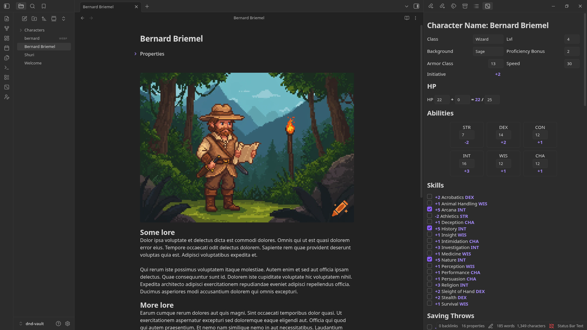

# Obsidian: DnD Character Sheet Tool

This is a simple DnD charactersheet viewer/editor. It enables the creation and viewing of charactersheets directly inside of Obsidian.

## Key features

- Editing fields directly in the charactersheet view
- Automatically calculate "calculated" fields such as Initiative, HP, Skills
- Embed character sheet directly into file properties, to allow for additional writing inside the file
- The ability to add links to saved spells, to allow for easy lookup and opening them in your browser

## Installation

### Install from Obsidian

1. Open your vault
2. Open Settings > Community plugins > Browse
3. Seach for "DnD Character Sheet Tool"
4. Install the Plugin

### Install from source

You can also install it directly from source.
This also means you need to have `npm` installed.
Execute the following commands inside your vault.

```bash
cd <your-vault>
git clone https://github.com/simonzweers/obsidian-dnd-charactersheet.git .obsidian/plugins/obsidian-dnd-charactersheet
cd .obsidian/plugins/obsidian-dnd-charactersheet
npm install && npm run build
```

## Usage

1. Enable the plugin: Settings > Community Plugins > Installed Plugins > Enable "DnD Character Sheet Tool"
2. Create a file with the name of your character (see the UI preview)
3. Click on the plugin icon "dice".
4. The character sheet view will pop up. It will say "This note has no frontmatter". Click on the "Create Character Sheet" button. This will load the view, and enable you to start editing your character.
5. (Optional) Add lore or other notes through the regular text editor.

## UI Preview

Below you can see an example of the layout with a simple character.




## TODO
- Fix bug where editing fist row of Attack/Spellcasting delets fields in second row
- Add the ability to edit Features & Traits.
- Search web for spell name and add option to automatically add a link

